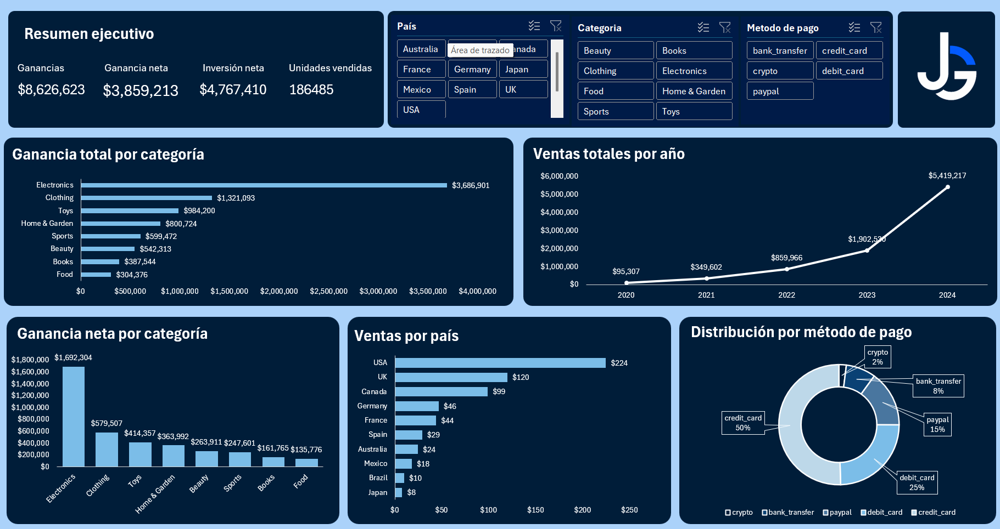
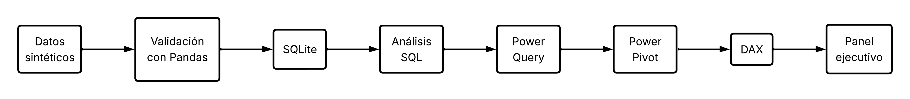
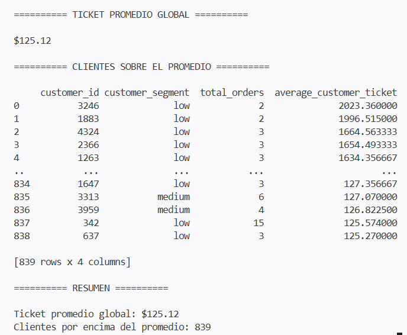

# Sales Analytics Dashboard

Pipeline de análisis de datos desarrollado en Python, SQL y Excel para generar, validar y analizar información de ventas, culminando en la construcción de un dashboard ejecutivo con indicadores clave de negocio.

El proyecto simula un escenario empresarial donde los datos son generados mediante Python, validados con Pandas y SQL, integrados en un modelo analítico con Power Query y Power Pivot, y finalmente visualizados mediante un dashboard interactivo en Excel.

---

# Dashboard

El resultado final del proyecto es un dashboard ejecutivo que resume automáticamente los principales indicadores del negocio.

<p align="center">
    
</p>

---

# Caso de uso

Una empresa necesita analizar el desempeño de sus ventas para identificar tendencias, evaluar la rentabilidad por categoría, comparar el comportamiento entre países y monitorear los principales indicadores financieros.

Para ello se implementó un flujo completo de análisis que permite:

- Generar un conjunto de datos sintético con comportamiento similar al de una empresa real.
- Validar la consistencia de la información mediante Pandas.
- Persistir los datos en SQLite.
- Realizar consultas SQL para obtener indicadores de negocio.
- Construir un modelo analítico utilizando Power Query y Power Pivot.
- Calcular métricas mediante DAX.
- Presentar los resultados en un dashboard ejecutivo en Excel.

---

# Flujo del pipeline

El proyecto sigue el siguiente flujo de procesamiento:

<p align="center">
    
</p>

---

# Validación mediante Python y SQL

Antes de construir el dashboard se realizaron diferentes análisis utilizando Pandas y consultas SQL para validar la calidad de los datos y obtener métricas de negocio.

Entre los análisis implementados se incluyen:

- Evolución mensual de ventas.
- Resumen de ventas mediante consultas SQL.
- Ventas por segmento de cliente.
- Tasa de cancelación.
- Clientes con ticket promedio superior al promedio global.

<p align="center">
    
</p>

---

# Tecnologías utilizadas

## Python

- Pandas
- NumPy
- SQLAlchemy
- SQLite

## Business Intelligence

- Microsoft Excel
- Power Query
- Power Pivot
- DAX

---

# Estructura del proyecto

```text
sales-analytics-dashboard/
│
├── dashboard/
│   └── sales_dashboard.xlsx
│
├── data_generator/
│   └── generate_sales_data.py
│
├── database/
│   └── sales.db
│
├── datasets/
│   ├── customers.csv
│   ├── products.csv
│   ├── orders.csv
│   └── order_items.csv
│
├── images/
│
├── sql_analysis/
│   ├── monthly_sales_metrics.py
│   ├── monthly_sales_sql.py
│   ├── customer_segment_analysis.py
│   └── customer_ticket_analysis.py
│
├── README.md
├── requirements.txt
└── LICENSE
```

---

# Ejecución

Instalar las dependencias:

```bash
pip install -r requirements.txt
```

Generar el conjunto de datos:

```bash
python data_generator/generate_sales_data.py
```

Ejecutar los análisis:

```bash
python sql_analysis/monthly_sales_metrics.py

python sql_analysis/monthly_sales_sql.py

python sql_analysis/customer_segment_analysis.py

python sql_analysis/customer_ticket_analysis.py
```

Finalmente abrir:

```text
dashboard/sales_dashboard.xlsx
```

para explorar el dashboard interactivo.

---

# Habilidades demostradas

- Generación de datos sintéticos mediante Python.
- Manipulación y validación de datos con Pandas.
- Persistencia de información utilizando SQLite.
- Consultas SQL con JOIN, GROUP BY, HAVING y subconsultas.
- Construcción de indicadores de negocio.
- Modelado de datos mediante Power Query y Power Pivot.
- Creación de medidas utilizando DAX.
- Desarrollo de dashboards ejecutivos en Microsoft Excel.

---

# Autor

**Johnny M. Galicia O.**

Proyecto desarrollado como parte de mi portafolio profesional orientado a análisis de datos y Business Intelligence.