# Sales Analytics Dashboard V2

Pipeline automatizado de análisis de ventas desarrollado con **Python, SQL Server y Power BI**, diseñado para simular el flujo de trabajo de un proyecto real de **Data Analytics** y **Business Intelligence**.

El proyecto genera automáticamente datos sintéticos con comportamiento similar al de una empresa real, los carga en SQL Server, construye vistas analíticas mediante SQL, valida la integridad de la información y alimenta un dashboard interactivo desarrollado en Power BI.

Todo el proceso se ejecuta mediante un único pipeline automatizado desarrollado en Python.

---

# Dashboard

El resultado final del proyecto es un dashboard interactivo que permite explorar los principales indicadores del negocio mediante filtros dinámicos por año, país y categoría.

<p align="center">
    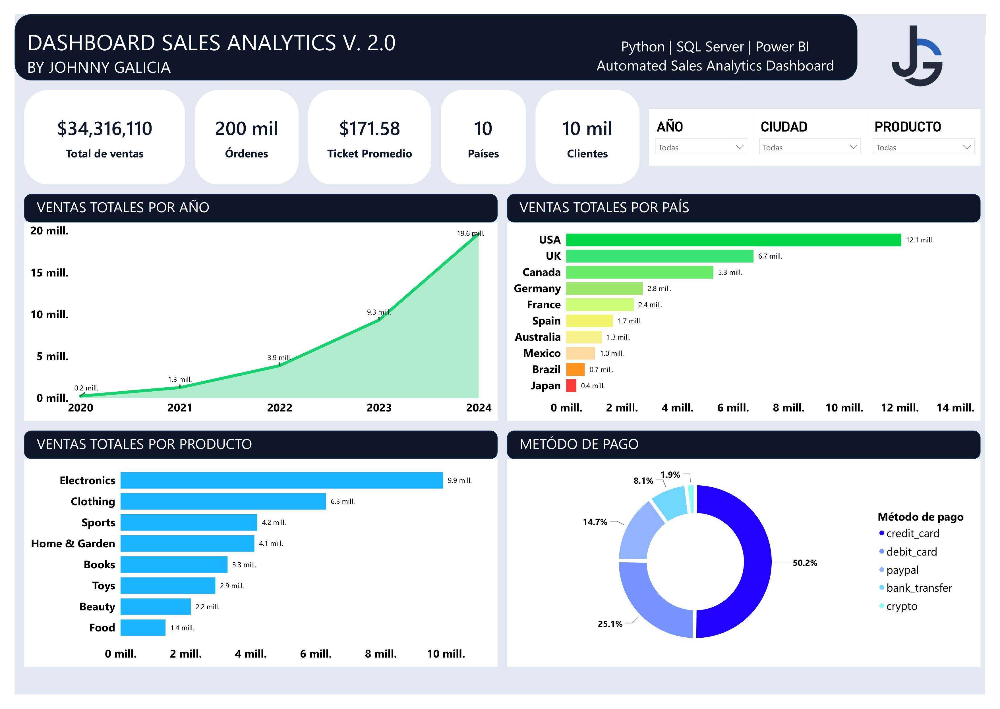
</p>

---

# Descripción del proyecto

En muchas organizaciones los datos provienen de diferentes fuentes y deben atravesar diversas etapas antes de convertirse en información útil para la toma de decisiones.

Este proyecto reproduce ese flujo de trabajo mediante un pipeline completo que integra:

- Generación de datos sintéticos utilizando Python.
- Carga automática de información en SQL Server.
- Construcción de SQL Views para análisis.
- Validación automática de la base de datos.
- Modelado analítico en Power BI.
- Desarrollo de un dashboard ejecutivo con indicadores de negocio.

El objetivo principal fue desarrollar una solución completa que integrara conceptos de **Ingeniería de Datos**, **SQL** y **Business Intelligence**, simulando una arquitectura utilizada en proyectos empresariales.

---

# Arquitectura del proyecto

El flujo general de procesamiento se muestra en el siguiente diagrama.

<p align="center">
    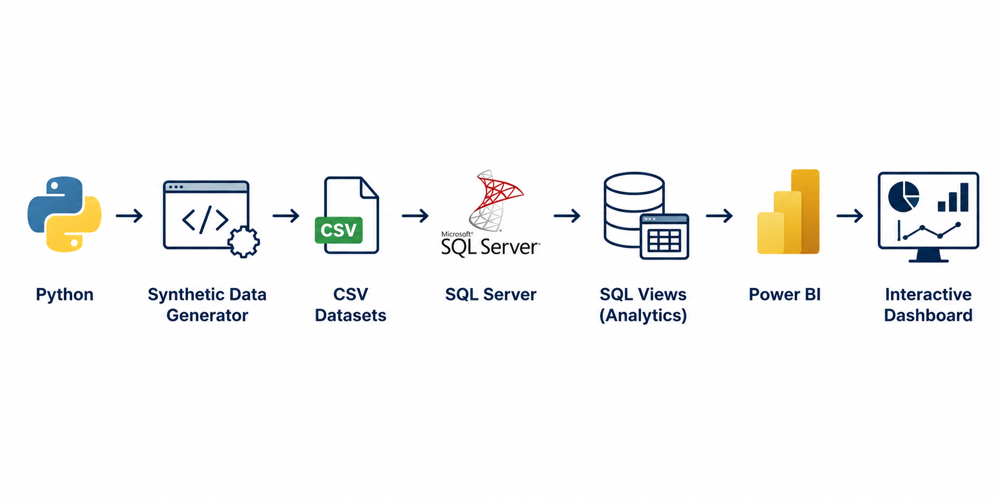
</p>

La arquitectura sigue el siguiente flujo:

1. Python genera datasets sintéticos con comportamiento empresarial.
2. Los archivos CSV son cargados automáticamente en SQL Server.
3. Se construyen SQL Views orientadas al análisis.
4. Power BI consume directamente dichas vistas.
5. El dashboard permite explorar la información mediante filtros dinámicos.

---

# Flujo del Pipeline ETL

Toda la automatización del proyecto se ejecuta desde un único archivo:

```bash
python run_pipeline.py
```

El pipeline está compuesto por tres etapas principales.

---

## 1. Generación automática de datasets

La primera etapa genera todos los archivos CSV que posteriormente serán utilizados por la base de datos.

Los datos fueron diseñados para simular el comportamiento de una empresa real mediante un modelo de crecimiento logístico, incorporando:

- Tendencias de crecimiento.
- Estacionalidad.
- Periodos de estabilidad.
- Variaciones en las ventas.
- Diferentes categorías de productos.
- Diversos métodos de pago.
- Clientes activos e inactivos.

<p align="center">
    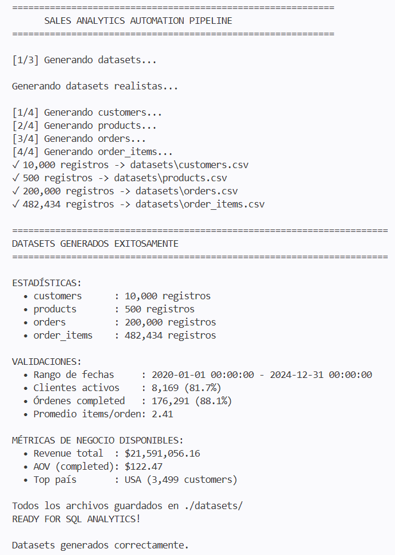
</p>

---

## 2. Carga automática en SQL Server

Una vez generados los datasets, el pipeline conecta automáticamente con SQL Server para cargar toda la información.

Durante esta etapa se realizan las siguientes operaciones:

- Limpieza de tablas existentes.
- Inserción automática de registros.
- Actualización completa de la base de datos.
- Confirmación de la carga realizada.

<p align="center">
    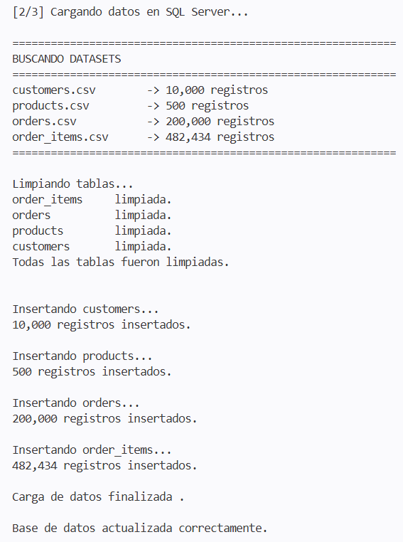
</p>

---

## 3. Validación de la información

Finalmente se ejecuta un proceso de validación que verifica la consistencia de la base de datos antes de utilizarla en Power BI.

Entre las validaciones realizadas se encuentran:

- Número de registros por tabla.
- Integridad de la carga.
- Confirmación de inserciones.
- Estado general del pipeline.

<p align="center">
    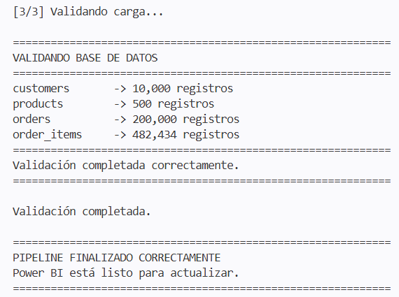
</p>

Al finalizar esta etapa, la base de datos queda lista para ser consumida por Power BI mediante las SQL Views desarrolladas para el proyecto.

---
# SQL Server

Una vez cargada la información, SQL Server actúa como el núcleo del proyecto, almacenando los datos transaccionales y proporcionando una capa analítica mediante SQL Views.

El uso de SQL Server permitió separar claramente las responsabilidades del pipeline:

- Almacenamiento de datos.
- Consultas analíticas.
- Creación de vistas para Business Intelligence.
- Integración directa con Power BI.

Las vistas desarrolladas simplifican el consumo de información y permiten mantener un modelo de datos limpio y escalable.

<p align="center">
    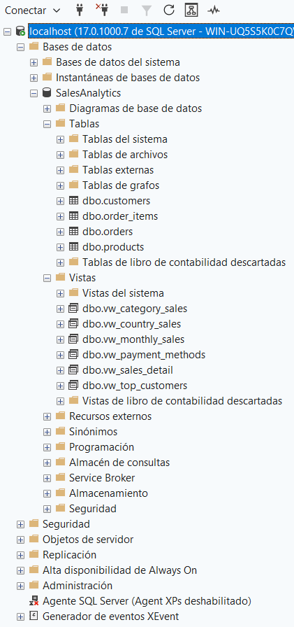
</p>

---

# SQL Views desarrolladas

Durante el proyecto se construyeron diferentes vistas orientadas al análisis de negocio.

Cada una de ellas responde a una necesidad específica del dashboard.

| View | Descripción |
|------|-------------|
| **vw_country_sales** | Ventas agregadas por país. |
| **vw_category_sales** | Ventas por categoría de producto. |
| **vw_monthly_sales** | Evolución mensual de las ventas. |
| **vw_top_customers** | Clientes con mayor volumen de compra. |
| **vw_payment_methods** | Distribución de ventas por método de pago. |
| **vw_sales_detail** | Vista principal utilizada por Power BI para construir el modelo analítico. |

La utilización de SQL Views permite reducir la complejidad del dashboard y trasladar parte del procesamiento directamente al motor de base de datos.

---

# Lógica de negocio mediante SQL

Además de consultas tradicionales, se implementó lógica de negocio utilizando T-SQL para clasificar clientes, calcular indicadores y construir métricas utilizadas posteriormente por Power BI.

Entre las operaciones desarrolladas se incluyen:

- JOIN entre múltiples tablas.
- GROUP BY.
- HAVING.
- CASE.
- Funciones de agregación.
- Cálculo de ventas.
- Cálculo de utilidad.
- Clasificación automática del tamaño de cada orden.
- Segmentación de clientes.

<p align="center">
    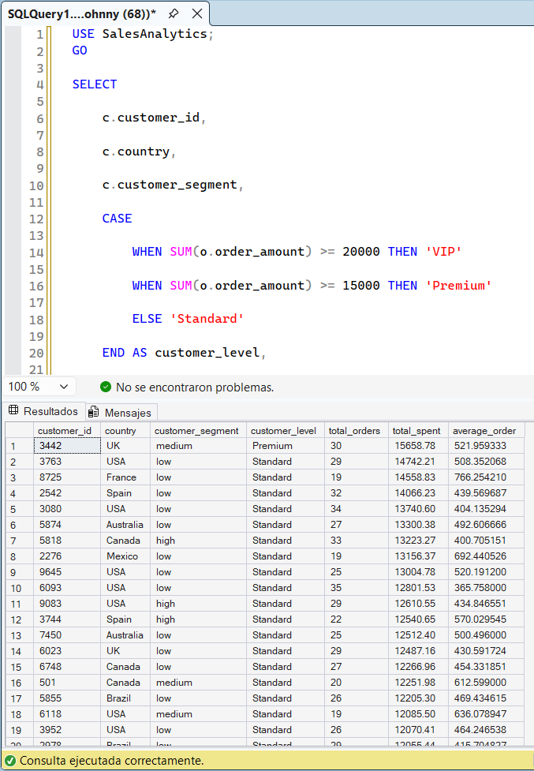
</p>

---

# Modelado de datos en Power BI

En lugar de consumir directamente los archivos CSV, Power BI obtiene toda la información desde SQL Server mediante la vista **vw_sales_detail**.

Este enfoque permite:

- Centralizar la lógica del negocio en SQL.
- Reducir transformaciones dentro de Power BI.
- Mantener un modelo sencillo.
- Facilitar futuras ampliaciones del proyecto.

<p align="center">
    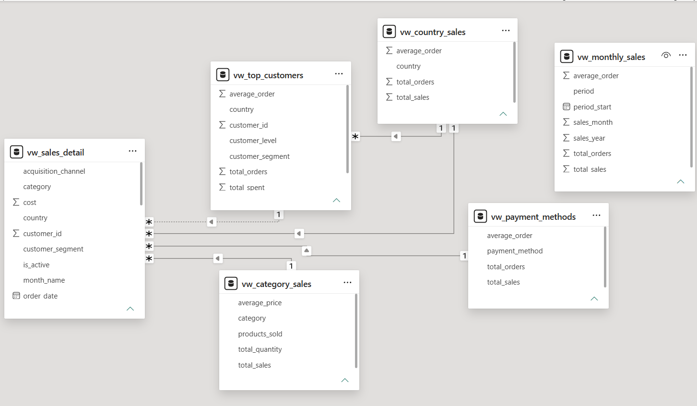
</p>

---

# Dashboard interactivo

El dashboard fue diseñado para proporcionar una visión ejecutiva del negocio mediante indicadores clave (KPIs) y visualizaciones interactivas.

Los usuarios pueden explorar la información utilizando filtros dinámicos por:

- Año.
- País.
- Categoría de producto.

Todos los indicadores responden automáticamente a los filtros seleccionados.

<p align="center">
    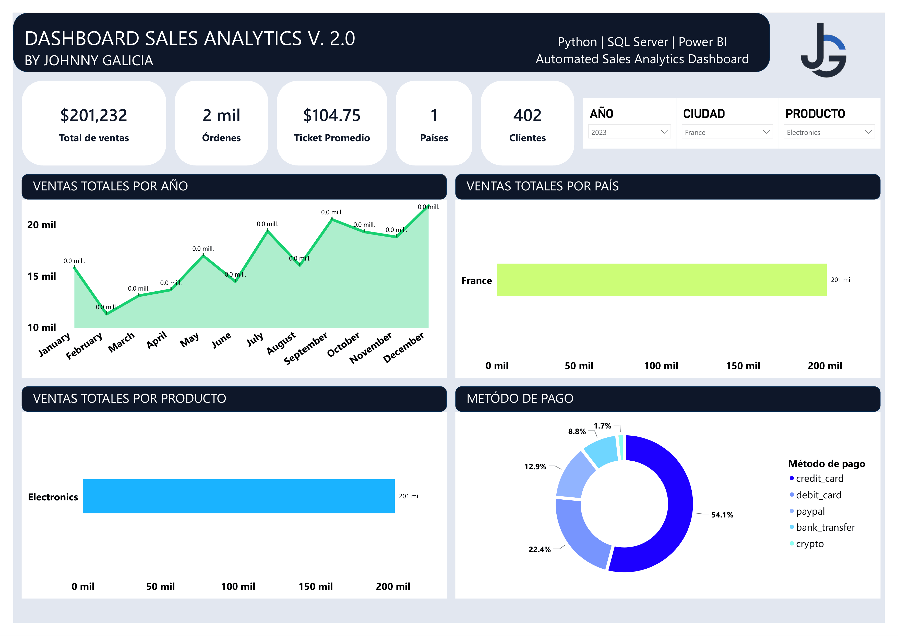
</p>

---

# Indicadores desarrollados

El dashboard incluye indicadores construidos mediante medidas DAX y consultas SQL.

## KPIs

- Total de ventas.
- Número de órdenes.
- Ticket promedio.
- Número de clientes.
- Número de países.

## Visualizaciones

- Evolución anual y mensual de ventas.
- Ventas por país.
- Ventas por categoría.
- Distribución por método de pago.

Las visualizaciones fueron diseñadas para facilitar el análisis exploratorio y la identificación de tendencias mediante segmentadores interactivos.

---

# Organización del proyecto

El proyecto fue estructurado de forma modular para facilitar su mantenimiento y escalabilidad.

<p align="center">
    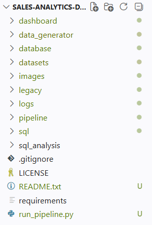
</p>

Cada módulo tiene una responsabilidad específica:

| Carpeta | Función |
|----------|----------|
| **data_generator** | Generación de datos sintéticos. |
| **datasets** | Archivos CSV generados automáticamente. |
| **database** | Conexión, carga y validación de SQL Server. |
| **pipeline** | Automatización del flujo ETL. |
| **sql** | Consultas y SQL Views. |
| **dashboard** | Dashboard desarrollado en Power BI. |
| **logs** | Registro automático de la ejecución del pipeline. |
| **images** | Recursos utilizados en la documentación del proyecto. |

---

# Tecnologías utilizadas

## Lenguaje de programación

- Python 3

## Librerías

- Pandas
- NumPy
- SQLAlchemy
- PyODBC
- Logging

## Base de datos

- Microsoft SQL Server
- SQL Server Management Studio (SSMS)
- T-SQL
- SQL Views

## Business Intelligence

- Microsoft Power BI
- DAX

## Ingeniería de Datos

- ETL Pipeline
- Generación de datos sintéticos
- Validación automática
- Archivos CSV
- Modelado relacional

---
# Instalación

Clonar el repositorio:

```bash
git clone https://github.com/johnnygalicia/sales-analytics-dashboard.git
```

Entrar al directorio del proyecto:

```bash
cd sales-analytics-dashboard
```

Instalar las dependencias:

```bash
pip install -r requirements.txt
```

---

# Ejecución

Toda la automatización del proyecto se realiza desde un único archivo.

Ejecutar:

```bash
python run_pipeline.py
```
<p align="center">
    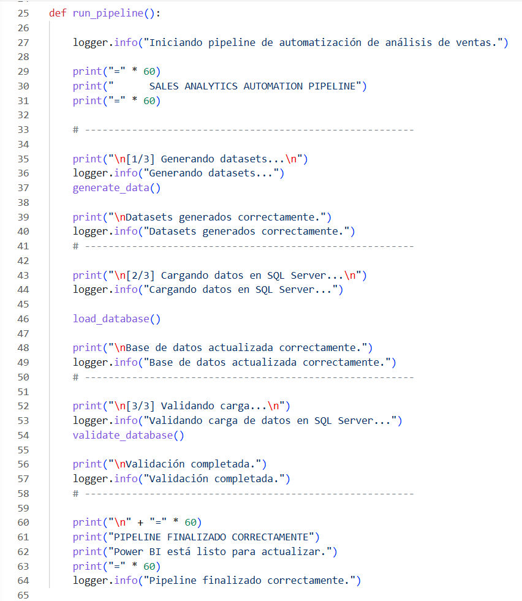
</p>

El pipeline realiza automáticamente las siguientes tareas:

✔ Generación de datos sintéticos.

✔ Carga automática de archivos CSV.

✔ Conexión con SQL Server.

✔ Inserción de registros.

✔ Validación de la base de datos.

✔ Registro automático mediante archivos LOG.

Una vez finalizado el proceso únicamente es necesario actualizar el modelo de Power BI para visualizar la nueva información.

---

# Sistema de Logging

Con el objetivo de facilitar el monitoreo y la depuración del pipeline, se implementó un sistema de registro automático mediante la librería **logging** de Python.

Cada ejecución genera información sobre:

- Inicio del proceso.
- Generación de datasets.
- Inserción de registros.
- Validaciones realizadas.
- Errores detectados.
- Finalización del pipeline.

Esto permite identificar rápidamente cualquier problema durante la ejecución y aporta una práctica común utilizada en proyectos reales de Ingeniería de Datos.

---

# Competencias demostradas

Este proyecto integra conocimientos de diferentes áreas relacionadas con Data Analytics, Ingeniería de Datos y Business Intelligence.

## Python

- Programación orientada a objetos.
- Organización modular del código.
- Automatización de procesos.
- Manejo de archivos CSV.
- Generación de datos sintéticos.
- Logging.
- Validación automática.
- Buenas prácticas de programación.

## SQL Server

- Diseño de bases de datos relacionales.
- Creación de tablas.
- Inserción masiva de datos.
- SQL Views.
- Consultas analíticas.
- JOIN.
- GROUP BY.
- HAVING.
- CASE.
- Funciones de agregación.

## Ingeniería de Datos

- Desarrollo de pipelines ETL.
- Automatización de cargas.
- Validación de información.
- Organización modular del proyecto.
- Arquitectura de procesamiento de datos.
- Integración entre Python y SQL Server.

## Business Intelligence

- Modelado de datos.
- Microsoft Power BI.
- KPIs.
- Medidas DAX.
- Dashboard interactivo.
- Segmentadores.
- Jerarquías.
- Visualizaciones dinámicas.

---

# Principales mejoras de la versión 2

La segunda versión representa una evolución importante respecto al proyecto original.

Entre las mejoras implementadas destacan:

- Migración de SQLite a Microsoft SQL Server.
- Reemplazo del dashboard desarrollado en Excel por Power BI.
- Implementación de un pipeline ETL completamente automatizado.
- Incorporación de SQL Views para análisis.
- Desarrollo de una vista principal (**vw_sales_detail**) para alimentar el modelo de Power BI.
- Sistema automático de validación.
- Registro de ejecución mediante archivos LOG.
- Modelo de crecimiento logístico para generar datos sintéticos más cercanos al comportamiento de una empresa real.
- Dashboard interactivo con filtros dinámicos.
- Organización modular del proyecto para facilitar mantenimiento y escalabilidad.

---

# Aprendizajes obtenidos

Durante el desarrollo de esta segunda versión fue posible integrar conocimientos de distintas herramientas dentro de un mismo flujo de trabajo.

Entre los principales aprendizajes se encuentran:

- Diseño de pipelines ETL utilizando Python.
- Integración entre Python y SQL Server.
- Creación de SQL Views orientadas al análisis.
- Modelado de datos para Business Intelligence.
- Construcción de dashboards interactivos con Power BI.
- Automatización de procesos de análisis de datos.
- Organización de proyectos con una arquitectura modular.

---

# Próximas mejoras

El proyecto continuará evolucionando con nuevas funcionalidades orientadas a Ingeniería de Datos y Analítica Avanzada.

Entre las mejoras planeadas se encuentran:

- Migración del proyecto a PostgreSQL.
- Contenerización mediante Docker.
- Interfaz gráfica para captura de ventas.
- Actualización automática del dashboard.
- Incorporación de modelos de Machine Learning para análisis predictivo.
- Simulación de un sistema transaccional conectado al pipeline analítico.

---

# Autor

**Johnny M. Galicia Orihuela**

Estudiante de Física | Data Analytics | Business Intelligence

Este proyecto fue desarrollado como parte de mi portafolio profesional con el objetivo de aplicar conocimientos de Python, SQL Server y Power BI en un flujo de trabajo similar al utilizado por equipos de análisis de datos dentro de una empresa.

---

# Licencia

Este proyecto se distribuye bajo la licencia MIT.
